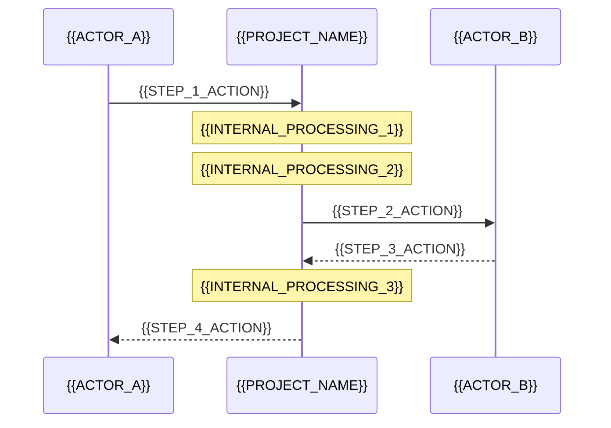

# CLI-Tool / Dev-Tool README Template

<!--
  TEMPLATE: cli-tool-readme.md
  Based on: CloakCode README (Gold reference)
  For: CLI tools, developer utilities, local dev infrastructure
  Quality target: Gold tier (see github-presence playbook)

  PLACEHOLDERS to replace:
    {{PROJECT_NAME}}     — e.g. "CloakCode"
    {{PROJECT_SLUG}}     — e.g. "cloakcode" (lowercase, URL-safe)
    {{TAGLINE}}          — one sentence: what it does and for whom
    {{GITHUB_URL}}       — e.g. "https://github.com/janrummel/cloakcode"
    {{GITHUB_USER}}      — e.g. "janrummel"
    {{BINARY_NAME}}      — the CLI command users run, e.g. "cloakcode"
    {{INSTALL_MANAGER}}  — e.g. "uv", "npm", "pip", "brew"
    {{TECH_LANG}}        — primary language, e.g. "Python 3.12+"
    {{TECH_CORE_DEP}}    — main dependency, e.g. "mitmproxy"
    {{CONFIG_FILE}}      — e.g. "~/.cloakcode/config.yaml"
    {{CONFIG_EXAMPLE}}   — e.g. "config.example.yaml"
    {{LICENSE}}          — e.g. "MIT"
    {{TEST_COUNT}}       — e.g. "190 tests, <0.5s"
-->

---

<!--
  HERO SECTION
  Centered block: ASCII art or large emoji, project name as h1, tagline, badges, nav links.
  Goal: First 5 seconds — visitor understands what this is and that it works.
  Keep the visual weight high; this is the only decorative section.
-->

<div align="center">

<!-- Replace with ASCII banner or large emoji relevant to the tool's function -->
```
{{ASCII_BANNER_OR_EMOJI}}
```

# {{PROJECT_NAME}}

**{{TAGLINE}}**

<!--
  BADGES: Pick 2-4 max. Recommended: license, language/version, test status, latest release.
  Use shields.io. Do not add badges that are always green (they add no signal).
-->


[]({{GITHUB_URL}}/actions)
[]({{GITHUB_URL}}/releases)

<!--
  NAV LINKS: Internal anchor links to the main sections below.
  Use the exact heading text, lowercased and hyphenated.
  Keep to 4-6 links. This acts as a quick-jump table for skimmers.
-->
[Why](#why) · [How it works](#how-it-works) · [Quick start](#quick-start) · [Configuration](#configuration) · [FAQ](#faq)

</div>

---

## Why

<!--
  PROBLEM STATEMENT — 3-5 sentences max.
  Structure:
    1. State what happens by default (the problem the tool solves).
    2. Say where {{PROJECT_NAME}} intervenes.
    3. One sentence on stakes / why it matters beyond convenience.
  Do not start with "I built this because...". Stay second-person or factual.
-->

{{DESCRIBE_THE_PROBLEM_THIS_TOOL_SOLVES}}

{{PROJECT_NAME}} sits between {{TOOL_OR_SYSTEM_IT_INTERCEPTS}} and {{DESTINATION}}, automatically {{CORE_ACTION}} before {{NEGATIVE_OUTCOME}}.

**This isn't just a convenience tool.** {{ONE_SENTENCE_ON_STAKES}}

---

## How it works

<!--
  ARCHITECTURE — Two diagrams, both mermaid.
  Diagram 1: High-level flow (graph LR). Show the 3-4 main nodes and the data flow.
  Diagram 2: Request lifecycle (sequenceDiagram). Show the happy path step by step.
  Keep node labels short (1-3 words). Use consistent color scheme across both.
  Color palette used in CloakCode: dark backgrounds (#1a1a2e), accent red (#e94560).
-->

```mermaid
graph LR
    INPUT[{{INPUT_NODE}}] -->|request| TOOL[{{PROJECT_NAME}}]
    TOOL -->|processed request| OUTPUT[{{OUTPUT_NODE}}]
    OUTPUT -->|response| TOOL
    TOOL -->|result| INPUT

    subgraph {{PROJECT_NAME}}
        STEP1[{{INTERNAL_STEP_1}}]
        STEP2[{{INTERNAL_STEP_2}}]
        STEP3[{{INTERNAL_STEP_3}}]
        STEP4[{{INTERNAL_STEP_4}}]
    end

    style INPUT fill:#1a1a2e,stroke:#e94560,color:#fff
    style TOOL fill:#0f3460,stroke:#e94560,color:#fff
    style OUTPUT fill:#1a1a2e,stroke:#16213e,color:#fff
```

### Request lifecycle



### Before & after

<!--
  BEFORE/AFTER: Show raw input vs. processed output.
  Two code blocks, side by side (or stacked). Label clearly.
  Pick the most dramatic / relatable example. Keep to 4-6 lines each.
-->

What {{DOWNSTREAM_SERVICE}} sees **without** {{PROJECT_NAME}}:
```
{{BEFORE_EXAMPLE_LINE_1}}
{{BEFORE_EXAMPLE_LINE_2}}
{{BEFORE_EXAMPLE_LINE_3}}
{{BEFORE_EXAMPLE_LINE_4}}
```

What {{DOWNSTREAM_SERVICE}} sees **with** {{PROJECT_NAME}}:
```
{{AFTER_EXAMPLE_LINE_1}}
{{AFTER_EXAMPLE_LINE_2}}
{{AFTER_EXAMPLE_LINE_3}}
{{AFTER_EXAMPLE_LINE_4}}
```

{{ONE_LINE_SUMMARY_OF_THE_TRADEOFF}}

---

## What it {{DETECTS_OR_DOES}}

<!--
  FEATURE TABLE: Two columns — Category | Examples.
  List 7-10 rows. Use concrete examples in the right column, not vague descriptions.
  This is the section that converts skeptics. Be specific.
-->

| Category | Examples |
|---|---|
| {{CATEGORY_1}} | {{EXAMPLE_1}} |
| {{CATEGORY_2}} | {{EXAMPLE_2}} |
| {{CATEGORY_3}} | {{EXAMPLE_3}} |
| {{CATEGORY_4}} | {{EXAMPLE_4}} |
| {{CATEGORY_5}} | {{EXAMPLE_5}} |
| {{CATEGORY_6}} | {{EXAMPLE_6}} |
| {{CATEGORY_7}} | {{EXAMPLE_7}} |
| Custom Patterns | User-defined regex via config |

---

## Quick start

<!--
  QUICK START: Exactly 3 commands to go from zero to running.
  Single bash block. Comments (#) before each command explain what it does.
  No prose between the steps — the comments carry all the explanation.
  If install requires a prerequisite (e.g. uv, node), note it in one comment line.
-->

```bash
# Clone
git clone {{GITHUB_URL}}.git
cd {{PROJECT_SLUG}}

# Install (requires {{INSTALL_MANAGER}})
{{INSTALL_COMMAND}}

# Verify: run the tool
{{BINARY_NAME}} {{VERIFY_COMMAND}}
```

---

## Using with {{PRIMARY_INTEGRATION}}

<!--
  INTEGRATION SECTION: Show the most common real-world usage.
  Use a two-terminal pattern if the tool runs as a background process.
  Keep comments minimal — one per meaningful step.
-->

```bash
# Terminal 1: Start {{PROJECT_NAME}}
{{START_COMMAND}}

# Terminal 2: Use {{PRIMARY_INTEGRATION}} through {{PROJECT_NAME}}
{{INTEGRATION_ENV_VAR_1}}={{INTEGRATION_VALUE_1}}
{{INTEGRATION_ENV_VAR_2}}={{INTEGRATION_VALUE_2}}
{{DOWNSTREAM_COMMAND}}
```

---

## Configuration

<!--
  CONFIGURATION: One bash copy command + one YAML (or equivalent) example.
  Show the 4-6 most important settings. Include inline comments.
  Every key needs a comment explaining what it does and valid values.
-->

```bash
cp {{CONFIG_EXAMPLE}} {{CONFIG_FILE}}
```

```yaml
# {{CONFIG_FILE}}

{{CONFIG_SECTION_1}}:
  {{KEY_1}}: "{{VALUE_1}}"   # {{EXPLANATION_1}}
  {{KEY_2}}:
    - "{{EXCEPTION_EXAMPLE}}"  # {{EXPLANATION_2}}
  {{KEY_3}}:
    - name: "{{CUSTOM_PATTERN_NAME}}"
      pattern: "{{CUSTOM_PATTERN_REGEX}}"
      replacement_prefix: "{{CUSTOM_REPLACEMENT_PREFIX}}"

{{CONFIG_SECTION_2}}:
  host: "localhost"
  port: {{DEFAULT_PORT}}
  {{KEY_4}}: {{VALUE_4}}    # {{OPTION_A}} | {{OPTION_B}}

{{CONFIG_SECTION_3}}:
  {{KEY_5}}: false           # {{EXPLANATION_5}}
```

---

## Features

<!--
  FEATURES: One h3 per major feature. 2-4 sentences per subsection.
  Order: most distinctive → most expected.
  If a feature has non-obvious behavior, show a code snippet or mermaid diagram.
  Do not list every feature — pick the ones that differentiate the tool.
-->

### {{FEATURE_1_NAME}}

{{FEATURE_1_DESCRIPTION}}

### {{FEATURE_2_NAME}}

{{FEATURE_2_DESCRIPTION}}

### {{FEATURE_3_NAME}}

{{FEATURE_3_DESCRIPTION}}

### {{FEATURE_4_NAME}}

{{FEATURE_4_DESCRIPTION}}

<!--
  If a feature involves routing/classification logic, use a mermaid graph TD.
  Example below shows the classification pattern from CloakCode.
-->

### {{ROUTING_FEATURE_NAME}}

All {{TRAFFIC_TYPE}} is classified into categories:

```mermaid
graph TD
    REQ[Incoming {{INPUT_UNIT}}] --> CL{Classify}
    CL -->|{{ROUTE_1_CONDITION}}| R1["{{ROUTE_1_LABEL}}"]
    CL -->|{{ROUTE_2_CONDITION}}| R2["{{ROUTE_2_LABEL}}"]
    CL -->|{{ROUTE_3_CONDITION}}| R3["{{ROUTE_3_LABEL}}"]

    R1 --> ACTION1[{{ACTION_1}}]
    R2 --> ACTION2[{{ACTION_2}}]
    R3 --> ACTION3[{{ACTION_3}}]

    style R1 fill:#2d6a4f,stroke:#95d5b2,color:#fff
    style R2 fill:#9d0208,stroke:#e5383b,color:#fff
    style R3 fill:#1a1a2e,stroke:#adb5bd,color:#fff
```

---

## Tech stack

<!--
  TECH STACK: Bulleted list, 4-6 items. Format: Name — role (one sentence).
  Link the main dependency. For each item, explain why it was chosen, not just what it is.
-->

- {{TECH_LANG}}
- [{{TECH_CORE_DEP}}]({{TECH_CORE_DEP_URL}}) — {{TECH_CORE_DEP_ROLE}}
- {{TECH_DEP_2}} — {{TECH_DEP_2_ROLE}}
- {{TECH_DEP_3}} — {{TECH_DEP_3_ROLE}}

---

## Architecture

<!--
  ARCHITECTURE POINTER: One line pointing to the spec doc.
  Do not duplicate architecture content here. The spec is the source of truth.
  If no spec doc exists, create docs/SPEC.md and point to it.
-->

See [docs/SPEC.md](docs/SPEC.md) for the full architecture specification.

---

## Development

<!--
  DEVELOPMENT: Install dev deps + run tests + any live/integration test.
  All in one bash block. Show test count and expected runtime in a comment.
-->

```bash
# Install with dev dependencies
{{DEV_INSTALL_COMMAND}}

# Run tests ({{TEST_COUNT}})
{{TEST_COMMAND}}

# Live test ({{LIVE_TEST_DESCRIPTION}})
{{LIVE_TEST_COMMAND}}
```

---

## FAQ

<!--
  FAQ: Exactly 5 questions. Bold question on its own line, answer below.
  Pick questions that:
    1. Address the most common skeptic objection
    2. Cover the main failure mode
    3. Address safety / trust
    4. Address quality / output degradation
    5. Address scope / who else can use it
  Answers: 2-4 sentences. Concrete, no hedging.
-->

**{{FAQ_QUESTION_1}}**
{{FAQ_ANSWER_1}}

**{{FAQ_QUESTION_2}}**
{{FAQ_ANSWER_2}}

**{{FAQ_QUESTION_3}}**
{{FAQ_ANSWER_3}}

**{{FAQ_QUESTION_4}}**
{{FAQ_ANSWER_4}}

**{{FAQ_QUESTION_5}}**
{{FAQ_ANSWER_5}}

---

## Contributing

<!--
  CONTRIBUTING: Clone + install + test in one bash block.
  One sentence on when to open an issue first.
  One sentence on any hard rule for PRs (e.g. test coverage requirement).
-->

Contributions are welcome! To get started:

```bash
# Fork and clone
git clone {{GITHUB_URL_FORK}}
cd {{PROJECT_SLUG}}

# Install with dev dependencies
{{DEV_INSTALL_COMMAND}}

# Run tests
{{TEST_COMMAND}}
```

Please open an issue before submitting large changes. {{CONTRIBUTION_HARD_RULE}}

---

## License

{{LICENSE}}
